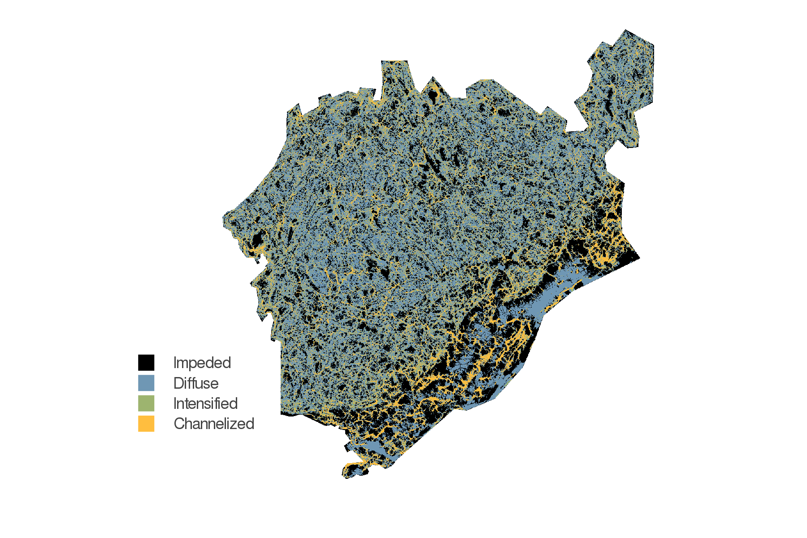

This template uses `pandoc` (and a few additional python glue scripts) to
facilitate the production of scientific articles using a standard markdown file.
The objective is to ensure that standard markdown (with the important exception
of the `pandoc-crossref` citation markup) will be rendered into an interactive
website (which allows collaborative annotations with the `hypothes.is`
platform), a "draft" style PDF (double-spaced, numbered lines, figures at the
end), and a "preprint" style PDF (with slightly more reader-friendly
pagination).

The core bit of configuration is the `metadata.json` file, which handles
information about authorship, affiliations, the abstract, keywords, etc. All
documents will be deployed to `gh-pages` *only* on push events from the `main`
branch. All of the artifacts will be built when doing pull requests, so you can
check that merging a branch is *not* going to cause the compilation of the
documents to fail; indeed, you can download the artifacts produced during the
run, to check the PDF and html files. The website is only updated from the
`main` branch.

The workflow is *very* GitHub based, and so the manuscript file *is* the
`README.md` - this is not going to be a huge issue as 90% of the markdown is
standard, with the exception of the citations and mathematics, so this will
render (mostly) like a normal README file.

# Deploying the template

The process of deploying this template has been *greatly* streamlined from
previous versions:

- Click on the "Use this template" button
- Edit `README.md` with your own text, commit, and push
- This push will trigger the first build - the builds are only active on the `main` branch (*not* `master`!), and on pull requests
- Go to `http://you.github.io/repo-name/` to view the html version, and get access to the PDFs
- Add your references to the `references.bib` file
- Edit the `metadata.json` file to add the title, abstract, authors

In particular, note that *you do not need* to create a personnal access token to
deploy to `gh-pages` (from where the website is served).

# The metadata file

## General information

The title is a field in the `metadata.json`:

~~~json
{
    "title": "Preprint template"
}
~~~

## Authorship

Authors are listed as objects in the `authors` block. Each author is specified
as follows:

~~~json
{
      "familyname": "Bob",
      "givennames": "Alice",
      "email": "alice.bob@u.edu",
      "orcid": "0000-0000-0000-0001",
      "affiliations": [
        "Affiliation 1",
        "Affiliation 2"
      ],
      "status": ["corresponding", "equal"]
    }
~~~

The `email` field is recommended for all authors. The `status` field is only
useful for the corresponding author, and to denote equal contributions. These
informations are rendered on the initial page. If an `orcid` is given, it will
be linked on the HTML and PDF versions.

Note that there is *no need* to number the affiliations - a small python script
will take care of this automatically.

## Abstract

This template supports three types of abstracts, indicated in the metadata file
as `abstract`:

A regular `abstract` is defined as

~~~json
"abstract": "A very long string"
~~~

An itemized abstract is an array of strings, each representing a bullet point:

~~~json
"abstract": [
    "Point 1",
    "Point 2"
]
~~~

A structured abstract is an object with key-value pairs :

~~~json
"abstract": {
    "Location": "Worldwide",
    "Organisms": "Mammals"
}
~~~

## Citation style

The `citationstyle` key corresponds to the name, with `.csl` ommited, of a CSL
stylesheet stored in the [citation style language][csl] repository. Note that
there is no difference between main and dependent styles, the build engine will
take the correct steps to get the correct style. The default is
`"citationstyle": "ecology-letters"`. There is a longer section about references
management later on.

[csl]: https://github.com/citation-style-language/
# References management

The references are managed by `pandoc`. Note that we *do not* use
`pandoc-citeproc`, which was an external module for older `pandoc` versions.
References *must* be stored in a `references.bib` file, and that it would make
sense to order it alphabetically by key.

We use [Zotero](https://www.zotero.org/) for references management, and for the
lab's manuscripts, we work from folders in a shared library (with a folder for
every manuscript).

It is recommedned to use the [Better
BibTeX](https://retorque.re/zotero-better-bibtex/) plugin for citation key
generations, and auto-export of the shared library to the `references.bib` file.
We use a citation key format meant to convey information on the author (first
author full name), date (complet year), and title (first three letters of the
first two non-stop words). It must be set in the Better BibTeX preferences as
(you might need to remove the line changes):

~~~
[auth:fold]
[year]
[title:fold:nopunctordash:skipwords:lower:select=1,1:substring=1,3:capitalize]
[title:fold:nopunctordash:skipwords:lower:select=2,2:substring=1,3:capitalize]
~~~

It is a good idea to configure Better BibTeX to auto-export on change, and to
remove a lot of fields that are not strictly speaking required for references.
The list of fields we usually ignore is:

~~~
abstract,copyright,annotation,file,pmid,month,shorttitle,keywords
~~~

The citations are done using the normal markdown syntax, where
`@Elton1927AniEco` produces @Elton1927AniEco, and `[@Camerano1880EquViv]`
produces [@Camerano1880EquViv].

# Figures, Tables, and other floats

Note that you can wrap the text of legends for both figures and tables. This
avoids the issue of having very long lines.

## Mathematics

The following equation

$$J'(p) = \frac{1}{\text{log}(S)}\times\left(-\sum p \times \text{log}(p)\right)$$ {#eq:eq1}

is produced using

~~~latex
$$J'(p) = \frac{1}{\text{log}(S)}\times ... $$ {#eq:eq1}
~~~

and can be referenced using `@eq:eq1`, which will result in @eq:eq1. Note that
because we use `pandoc-crossref`, the label "eq." will be generated
automatically.

## Tables

Table legends go on the line after the table itself. To generate a reference to
the table, use `{#tbl:id}` -- then, in the text, you can use `{@tbl:id}` to
refer to the table. For example, the table below is @tbl:id. You can remove the
*table* in front by using `!@tbl:id`, or force it to be capitalized with
`\*tbl:id`.

| Sepal.Length | Sepal.Width | Petal.Length | Petal.Width | Species |
|-------------:|------------:|-------------:|------------:|:--------|
|          5.1 |         3.5 |          1.4 |         0.2 | setosa  |
|          5.0 |         3.6 |          1.4 |         0.2 | setosa  |
|          5.4 |         3.9 |          1.7 |         0.4 | setosa  |

Table: This is a table, and its identifier is `id` -- we can refer to it using
`{@tbl:id}`. Note that even if the table legend is written below the table
itself, it will appear on top in the PDF document. {#tbl:id}

# Figures

Figures can have a legend -- all figures *must* be in the `figures/` folder of
the project, as it is also used for the website. We recommend to use good
resolution images, rather than PDFs, or at least to have multiple versions
available.

~~~
{#fig:figure}
~~~

{#fig:figure}

We can now use `@fig:figure` to refer to @fig:figure.

# Example text

Connectance, defined as the ratio of realized interactions on the total number
of potential interactions, is one of the most common descriptor of network
structure. In a bipartite network with $T$ species at the top, and $B$ at the
bottom, having a total of $L$ interactions, it is defined as $Co = L/(T\times
B)$. Connectance has a lower bound, as the network cannot have fewer
interactions that the number of species in its more speciose level -- the
minimal connectance is therefore $c_m = \text{max}(T,B)$. This makes the
connectance of networks of different sizes difficult to compare, especially
since bipartite networks tends to have a low connectance. For this reason, we
used a corrected version of connectance, defined as

$$Co^\star=\frac{L-c_m}{T\times B-c_m} \,.$${#eq:cstar}

## This is a subsection

This takes values between 0 (the network has the minimal number of interactions)
and 1 (all species are connected), but is robust to variations in species
richness.

## This is another subsection

This takes values between 0 (the network has the minimal number of interactions)
and 1 (all species are connected), but is robust to variations in species
richness.

## Some non-standard maths

The phylogenetic reconstruction of $\hat{\mathscr{L}}$ and $\hat{\mathscr{R}}$
has an associated uncertainty, represented by the breadth of the uniform
distribution associated to each of their entries. Therefore, we can use this
information to assemble a *probabilistic* metaweb in the sense of
@Poisot2016StrPro, *i.e.* in which every interaction is represented as a single,
independent, Bernoulli event of probability $p$.

Specifically, we have adopted the following approach. For every entry in
$\hat{\mathscr{L}}$ and $\hat{\mathscr{R}}$, we draw a value from its
distribution. This results in one instance of the possible left
($\hat{\mathscr{l}}$) and right ($\hat{\mathscr{r}}$) subspaces for the Canadian
metaweb. These can be multiplied, to produce one matrix of real values. Because
the entries in $\hat{\mathscr{l}}$ and $\hat{\mathscr{r}}$ are in the same space
where $\mathscr{L}$ and $\mathscr{R}$ were originally predicted, it follows that
the threshold $\rho$ estimated for the European metaweb also applies. We use
this information to produce one random Canadian metaweb, $N =
\hat{\mathscr{L}}$$\hat{\mathscr{R}}' \ge \rho$.

Because the intervals around some trait values can be broad [in fact, probably
broader than what they would actually be, see *e.g.* @Garland1999IntPhy], we
repeat the above process $2\times 10^5$ times, which results in a probabilistic
metaweb $P$, where the probability of an interaction (here conveying our degree
of trust that it exists given the inferred trait distributions) is given by the
number of times where it appears across all random draws $N$, divided by the
number of samples. An interaction with $P_{i,j} = 1$ means that these two
species were predicted to interact in all $2\times 10^5$ random draws, etc..

# References
