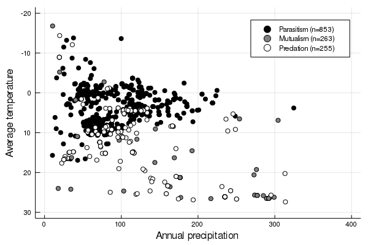

This template uses recent versions of `pandoc` and `pandoc-crossref` to
facilitate the referencing of equations, figures, and tables within the text.
For example, the following equation

$$J'(p) = \frac{1}{\text{log}(S)}\times\left(-\sum p \times \text{log}(p)\right)$$ {#eq:eq1}

is produced using

~~~latex
$$J'(p) = \frac{1}{\text{log}(S)}\times\left(-\sum p \times \text{log}(p)\right)$$ {#eq:eq1}
~~~

and can be referenced using `@eq:eq1`, which will result in @eq:eq1.

All documents will be deployed to `gh-pages` *only* on push events from the
`master` branch. All of the artifacts will be built when doing pull requests, so
you can check that merging a branch is *not* going to cause the compilation of
the documents to fail; indeed, you can download the artifacts produced during
the run, to check the PDF and html files.

# Using references

The references are managed by `pandoc`. Note that we *do not* use
`pandoc-citeproc`, which was an external module for older `pandoc` versions.
References *must* be stored in a `references.bib` file. We use
[Zotero](https://www.zotero.org/) for references management, and for the lab's
manuscripts, we work from folders in a shared library (with a folder for every
manuscript).

We use the [Better BibTeX](https://retorque.re/zotero-better-bibtex/) plugin for
citation key generations, and auto-export of the shared library to the
`references.bib` file. We use a citation key format meant to convey information
on the author, date, year, and title. It must be set in the Better BibTeX
preferences as

~~~
[auth:fold][year][title:fold:nopunctordash:skipwords:lower:select=1,1:substring=1,3:capitalize][title:fold:nopunctordash:skipwords:lower:select=2,2:substring=1,3:capitalize]
~~~

It is a good idea to configure Better BibTeX to auto-export on change, and to
remove a lot of fields that are not strictly speaking required for references.
The list of fields we usually ignore is:

~~~
abstract,copyright,annotation,file,pmid,month,shorttitle,keywords
~~~

The citations are done using the normal markdown syntax, where
`@Elton1927AniEco` produces @Elton1927AniEco, and `[@Camerano1880EquViv]`
produces [@Camerano1880EquViv].

# Tables

Table legends go on the line after the table itself. To generate a reference to
the table, use `{#tbl:id}` -- then, in the text, you can use `{@tbl:id}` to
refer to the table. For example, the table below is @tbl:id. You can remove the
*table* in front by using `!@tbl:id`, or force it to be capitalized with
`\*tbl:id`.

| Sepal.Length | Sepal.Width | Petal.Length | Petal.Width | Species |
|-------------:|------------:|-------------:|------------:|:--------|
|          5.1 |         3.5 |          1.4 |         0.2 | setosa  |
|          5.0 |         3.6 |          1.4 |         0.2 | setosa  |
|          5.4 |         3.9 |          1.7 |         0.4 | setosa  |

Table: This is a table, and its identifier is `id` -- we can refer to it using
`{@tbl:id}`. Note that even if the table legend is written below the table
itself, it will appear on top in the PDF document. {#tbl:id}

# Figures

Figures can have a legend -- all figures *must* be in the `figures/` folder of
the project, as it is also used for the website. We recommend to use good
resolution images, rather than PDFs, or at least to have multiple versions
available.

~~~
{#fig:biomes}
~~~

{#fig:biomes}

We can now use `@fig:biomes` to refer to @fig:biomes.

# Example text

Connectance, defined as the ratio of realized interactions on the total number
of potential interactions, is one of the most common descriptor of network
structure. In a bipartite network with $T$ species at the top, and $B$ at the
bottom, having a total of $L$ interactions, it is defined as $Co = L/(T\times
B)$. Connectance has a lower bound, as the network cannot have fewer
interactions that the number of species in its more speciose level -- the
minimal connectance is therefore $c_m = \text{max}(T,B)$. This makes the
connectance of networks of different sizes difficult to compare, especially
since bipartite networks tends to have a low connectance. For this reason, we
used a corrected version of connectance, defined as

$$Co^\star=\frac{L-c_m}{T\times B-c_m} \,.$${#eq:cstar}

## This is a subsection

This takes values between 0 (the network has the minimal number of interactions)
and 1 (all species are connected), but is robust to variations in species
richness.

## This is another subsection

This takes values between 0 (the network has the minimal number of interactions)
and 1 (all species are connected), but is robust to variations in species
richness.

# References
